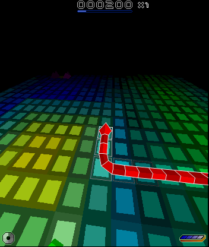
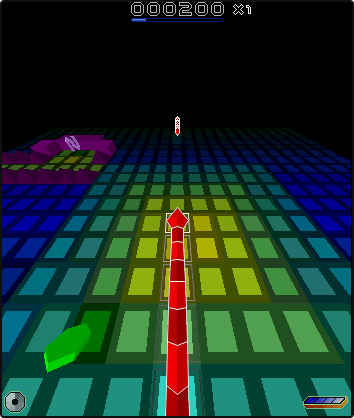

# Nokia N80 firmware assets

The N80 ROM and RPKG use the existing individual-file IPFS convention. Their
CIDs, SHA-256 hashes, sizes and source archive are recorded in
[n80-assets.json](n80-assets.json). The default benchmark still uses the Nokia
5320 assets.

The pair installs successfully as **Nokia N80 (05), RM-92, Symbian 9.1** with
machine UID `0x200005f9`. Its original `wsini.ini` declares 352×416 portrait and
416×352 landscape modes. The tested Snakes SIS now **passes native gameplay and
audio validation** after the Symbian 9.1 compatibility fixes below. The opt-in
resolution patch renders at **352×416**, 91% more pixels than the 5320's 240×320.
The unmodified game renders 176×208 and doubles both axes for the N80 display.



## Full-resolution Snakes

```sh
EKA2L1_SNAKES_N80_NATIVE_RESOLUTION=1 \
python3 src/tests/benchmark/run_native.py \
  --assets /absolute/path/to/n80-assets \
  --asset-manifest src/tests/benchmark/n80-assets.json \
  --binary /absolute/path/to/eka2l1_qt \
  --output /absolute/path/to/new-n80-full-resolution-run \
  --frames 240 --repeat 2 --timeout 300
```

For interactive native play, use the same environment variable and launch
`--run 0x2000730F` after installing the N80 device and the Snakes SIS. The browser
launcher has a **Snakes at full N80 resolution** checkbox; select the N80 ROM,
RPKG and the existing SIS, and use app UID `0x2000730F`. The checkbox currently
uses the interpreter, so browser execution is slower than the compiled 5320
path. N80 compiled execution stalls during startup even with the game patch off.

This changes three ARM instructions in the loaded copy of `6r45_1b.exe`: select
the normal blit for 352×416, and change the rendering rectangle from 176×208 to
352×416. Disabling doubling alone leaves the old small image in a corner; both
changes are necessary. The patch checks the UID, executable name, code size,
unrelocated code hash and original instructions before writing anything. It runs
before code relocation and CPU translation. The SIS, firmware files and IPFS
CIDs stay unchanged. This experiment covers N80 portrait, not arbitrary screen
sizes or other game releases.

Two native runs matched all 240 frames, guest timestamps, PCM samples and audio
events, covering 11.30 seconds of gameplay at 21.16 images per virtual second.
Every image has genuine single-pixel detail; none is an exact doubled 176×208
image. Visual inspection also confirms the scene fills the display. Disabling
the option reproduces the stock N80 output exactly, and enabling it on 5320
reproduces the previous 240×320 baseline exactly (60 frames each, including
audio). The native unit suite still passes all 330 cases and 28,873 assertions.
See [full-resolution evidence](n80-evidence/native-resolution.json).

The Chromium/WASM interpreter also completed 240 frames: **every image and PCM
sample matches native**. Instruction counts differ throughout, six image
timestamps differ, and audio event timestamps are not identical, so this is
not a pass of the stricter cross-target deterministic comparison. Both targets
pass gameplay and audio validation. The WASM build uses Emscripten 4.0.10.

The actual browser launcher checkbox also passed the existing live test flow:
gameplay, keyboard and touch input, mobile layout, blur-release and shutdown,
using Chromium's NVIDIA/Vulkan backend. The 10-second interval advanced only
4.18 guest seconds (0.417× real time), so this interpreter path is functional
but currently too slow for normal-speed play on the tested host. Live sound was
not enabled in that UI test; PCM correctness is covered by the replay above.



```sh
cd src/tests/wasm
EKA2L1_WASM_BUILD_DIR=/absolute/path/to/wasm-build/src/emu/wasm \
EKA2L1_ASSET_MANIFEST=../benchmark/n80-assets.json \
EKA2L1_SNAKES_N80_NATIVE_RESOLUTION=1 \
EKA2L1_BENCHMARK_AOT=0 \
node benchmark.ts /absolute/path/to/n80-assets /absolute/path/to/new-browser-run 240
```

Compiled modes 1 (exports), 4 (chained blocks), and 5 (regions) reached the
120-second virtual replay limit without gameplay. Mode 5 also failed with code
validation enabled and with unsafe-code mode 0; changing executable-byte
validation policy did not resolve it. The compiler issue remains open. An
earlier, separate browser abort when looking up missing panic descriptions was
fixed by checking YAML node types without relying on C++ exception catching.

## Options beyond 352×416

The N80 result is 146,432 rendered pixels. Larger firmware candidates still
need Snakes compatibility and rendering tests; display specifications alone
do not establish the game's internal resolution.

| # | Candidate | Display pixels | Relative to full-resolution N80 | Work remaining |
|---|---|---|---|---|
| 1 | Nokia E6, RM-609 | 640×480 = 307,200 | 2.10× | Install its Anna/Belle firmware, test the existing SIS, extend the renderer patch |
| 2 | Nokia E90, RA-6, internal display | 800×352 = 281,600 | 1.92× | Install firmware, select the internal display, extend the renderer patch |
| 3 | Virtual device, example target | 1280×720 = 921,600 | 6.29× | Supply compatible OS layouts or change layout selection, then extend game rendering and validate bounds |

The [Nokia E6 launch announcement](https://blogs.windows.com/devices/2011/04/12/launch-nokia-e6/)
confirms its 640×480 capacitive touchscreen and Symbian platform. It is the
preferred next physical-device target for pixel count and a conventional 4:3
landscape aspect ratio. The [Nokia E90 datasheet](https://manualzz.com/doc/2635566/nokia-e90-communicator-datasheet)
confirms its 800×352 internal screen and S60 3rd Edition platform. Its older S60
generation is closer to this game's original environment; easier game
compatibility is a hypothesis, not a measured result.

An [E90 firmware archive directory](https://firmware.center/firmware/Nokia/E90%20%28RA-6%29/Flash%20Files/)
lists versions 210.3 and 300.3. An [E6 Belle firmware listing](https://nokia-msft.ru/firmware/firmware-nokia-belle/firmware-rm-609/059f4l1/)
identifies core/ROFS/VPL files for revision 111.130.0625, but working file
downloads and emulator compatibility have not been verified for either target.

The previous [virtual-display sweep](RESOLUTION_RESULTS.md) reached `AVKON 61`
before gameplay at larger sizes. Changing `wsini.ini` alone therefore does not
complete the virtual-device option. The three N80 game changes establish that
Snakes' chosen rendering resolution can be changed; they do not establish an
arbitrary-resolution limit or guarantee 720p rendering.

## Working native runtime

The runtime includes upstream Symbian 9.1 support plus these corrections:

- Enable the 9.1 screen-driver and audio-output-stream replacement mappings.
  The audio mapping stops at the exports available in the N80 library.
- Decode 9.1 Central Repository searches as four arguments: partial key, mask,
  comparison value, and result descriptor. Later versions pack the filter into
  a descriptor and reserve the fourth slot for a subsession handle. Reading
  the newer layout on N80 broke the CommsDat lookup during game initialization.
- Use screen zero for the old zero-length supported-colour-modes request.
- Launch the installed game by UID `0x2000730F` (`6r45_1b.exe`). N80 already
  includes another Snakes, UID `0x10208A45` (`6r45_1.exe`), which an ambiguous
  `--run Snakes` selected before this correction.

Two fresh 60-frame runs matched every pixel, guest timestamp, audio event, and
PCM byte. Gameplay averaged 21.22 frames per virtual second, with 60 distinct
scene captures and non-silent audio. The unchanged 5320 assets also passed a
60-frame gameplay/audio regression. The native unit suite passed 330 cases and
28,873 assertions. See [runtime evidence](n80-evidence/gameplay.json).

All 60 unmodified N80 images consist of exact repeated 2×2 pixel blocks. The installed
game explicitly recognizes 352×416 and chooses a doubled presentation mode.
These stock-game results establish native-emulator compatibility, separately
from the opt-in rendering change above.

## Pin and retrieve

```sh
ipfs pin add bafybeich2rmx24qbgshmdf3pufazf2wujd5233sqgxkheh7c5ms4xm6edi
ipfs pin add bafybeihwio3n2bekh73lco4mo4mxt55iyryx6jzzn3fkpfiusdhih4s3em
mkdir n80-assets
ipfs cat bafybeich2rmx24qbgshmdf3pufazf2wujd5233sqgxkheh7c5ms4xm6edi > n80-assets/SYM.ROM
ipfs cat bafybeihwio3n2bekh73lco4mo4mxt55iyryx6jzzn3fkpfiusdhih4s3em > n80-assets/SYM.RPKG
ipfs cat bafybeicuomcc2zhzi3vwfb5xihnlkikz3biaa43g4d22z2wptcmhvmp3di > n80-assets/Snakes.sis
```

Both new blobs were recursively pinned locally and read back through `ipfs cat`
with matching SHA-256 hashes. This verifies the local IPFS objects; a remote
node's successful retrieval is a separate check.

## Reproduce the blobs

```sh
ipfs cat bafybeic6uqroqcxbqqrez5f7jjpowrrw7pp2lsylbzxr4mncvdker5i3tu > n80-firmware.zip
python3 src/tests/benchmark/extract_n80.py n80-firmware.zip reproduced-n80
```

The converter requires the exact archive hash, checks every ZIP member's CRC,
and checks both final output hashes. It only handles this firmware revision.
It needs Python's standard library; no emulator build or external unpacker is
required. The archive was downloaded from
[Android Data Host](https://androiddatahost.com/tryu5), linked by
[FirmwareFile](https://firmwarefile.com/nokia-n80-rm-92).

The source ZIP contains several product variants. Its included VPL files all
reference the same core, V05 language image and U01 user area. The selected
`RM92_0526969_5.0719.0.2_001.vpl` describes "RUSSIA Smooth Stainless"; its
referenced files passed the VPL CRC checks. The converter uses the core and V05
image, leaving the factory C: user area out of the fresh emulator profile.

The extraction procedure follows EKA2L1's ROM/ROFS layouts and the
[official RPKG packer](https://github.com/EKA2L1/rpkgmaker) format:

1. Read the old FPSX blocks using their exact lengths. The stock importer in the
   tested build assumes 512-byte padding, loses alignment and misclassifies the
   ROFx image as a FAT user area.
2. Select application-processor data. The `SOS*CORE` certificate at flash address
   `0x420000` contains the beginning of the raw DEFLATE stream at offset `0x3d0`.
   Append its contiguous data blocks starting at `0x420400`. Decompression reaches
   its end marker with 445 trailing `0xff` padding bytes. Remove the 48-byte zero
   prefix to obtain the ROM, whose stored uncompressed size is 21,217,280 bytes.
3. Extract 969 ROM entries and 2,333 base ROFS entries. Apply 3,518 V05 entries
   and resolve its 2,333 references to unchanged base ROFS files. After overlays,
   the Z: filesystem contains 6,819 files. All file and directory reads are
   checked against their source image bounds.
4. Write an RPK2 header with the N80 machine UID and sorted lowercase UTF-16LE
   paths. Use read-only/archive attributes and the base ROFS build timestamp for
   deterministic package metadata. ROM and filesystem content bytes are preserved.

The repository converter independently reproduced the same ROM and RPKG hashes
as the initial extraction and packaging.

## Original failed launch, 2026-10-01

This historical test launched the ROM-bundled `6r45_1.exe`, not the installed
SIS. Its evidence is retained to distinguish the earlier failure from the
passing benchmark above. The current runner uses the installed game's UID.

The native executable was frozen from an existing WASM-development checkout:
embedded version `wasm-port-25792310e`, SHA-256
`268ca713af03daf982a8f2583393d588461e4f2e83cfff0127d340b2d198ab56`.
It was not built from the documentation commit on master. Runs used fresh device
profiles, Xvfb and Mesa software OpenGL, with the existing deterministic input
replay and unchanged Snakes SIS.

```sh
python3 src/tests/benchmark/run_native.py \
  --assets /absolute/path/to/n80-assets \
  --asset-manifest src/tests/benchmark/n80-assets.json \
  --binary /absolute/path/to/eka2l1_qt \
  --output /absolute/path/to/new-n80-run \
  --frames 60 --repeat 1 --timeout 180
```

Before the compatibility fixes, device installation succeeded. The replay captured zero gameplay frames
before failure. A diagnostic run with `--start-us 0 --all-presentations` captured
one 352×416 startup image at virtual time 149,994 µs, then encountered the same
failure. The image contains a partial background, not gameplay.

The relevant log sequence is preserved in
[n80-evidence/failure.txt](n80-evidence/failure.txt). It reports a bad screen index,
unimplemented system calls `0x82` and `0xA`, and guest `USER-EXEC 3`, followed by a
host segmentation fault. These observations do not establish which emulator
defect causes the guest panic. The result neither proves nor disproves the
game's native 352×416 support on an actual N80.

The diagnostic [startup image](n80-evidence/startup-352x416.png) and
[validation metadata](n80-evidence/validation.json) distinguish successful
installation/display initialization from the failed gameplay test.

After adding manifest selection, the unchanged default 5320 runner passed a
fresh 60-frame gameplay capture and the gameplay-motion and audio validators.
The N80 command above reproduced the installation success and guest panic.
