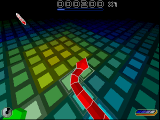

# Snakes custom-resolution experiment

Measured 2026-10-01 with the existing Nokia 5320d-1 RM-409 05.01 ROM and
benchmark Snakes SIS. Changing the guest display dimensions works at 240×320
and 320×240. Larger configurations fail during Avkon initialization with
`AVKON 61`, before gameplay. This experiment therefore establishes a constraint
in this ROM's UI configuration; it does **not** establish Snakes' maximum
rendering resolution.

| # | Guest mode 1 | Captured gameplay | Result |
|---|---|---|---|
| 1 | 240×320 | 60 images at 240×320 | Gameplay and audio pass; matches the unmodified control exactly |
| 2 | 320×240 | 60 images at 320×240 | Gameplay and audio pass |
| 3 | 640×480 | 0 images | Guest `AVKON 61`, followed by host shutdown SIGSEGV |
| 4 | 800×352 | 0 images | Guest `AVKON 61`, followed by host shutdown SIGSEGV |
| 5 | 1280×720 | 0 images | Guest `AVKON 61`, followed by host shutdown SIGSEGV |
| 6 | 352×416 | 0 images | Guest `AVKON 61`, followed by host shutdown SIGSEGV |

The three initially proposed larger sizes were repeated with kernel trace
logging enabled, confirming the same guest panic. 352×416 was an additional
probe, not a test using an actual Nokia N80 ROM.

## What the failure means

The [Symbian Avkon panic definition](https://github.com/SymbianSource/oss.FCL.sf.mw.classicui/blob/master/classicui_plat/ui_framework_definitions_api/inc/aknPanic.h#L173-L174)
names code 61 `EAknPanicLayoutMissing_AknLayout` and describes missing layout
data. At 640×480 a GDB breakpoint on `eka2l1::kernel::thread::kill` observed
the guest panic with category `AVKON` and reason 61. Subsequent runs logged
that same panic directly for all four larger sizes.

The host segmentation fault is secondary: the graphics thread calls
`stop_polling()` during shutdown and faults in `std::thread::join()`. It is
not evidence that a large guest framebuffer allocation overflowed. The
[captured trace](resolution-evidence/640x480-crash.txt) records both events.
No emulator shutdown repair was included in this experiment.

The earlier proposal that changing `wsini.ini` alone would allow an arbitrary
virtual display was incomplete. The emulator accepts the sizes and creates
the screen buffer, but the ROM's Avkon layout selection must also succeed.
Testing Snakes beyond this point requires suitable layout data, or an
experimental change to layout selection that lets initialization finish while
still exposing the larger drawing surface to the game. Neither was attempted
here. A larger host canvas would only test scaling.

## Method and validation

- Froze a copy of `build/bin`, including patch libraries and resources.
  The executable SHA-256 is
  `268ca713af03daf982a8f2583393d588461e4f2e83cfff0127d340b2d198ab56`.
  Its embedded revision is `wasm-port-25792310e`. The checkout at snapshot
  time was `69d6416beb860c6b63072079f2b1e738445bbe02`; the existing executable
  is **not** claimed to be a fresh build of that checkout.
- Verified all three original asset hashes from `run_native.py`, installed
  the device afresh, and cloned that installation separately for each run.
  No existing device profile, ROM blob, SIS blob, or game executable was edited.
- Changed `SCR_WIDTH1` / `SCR_HEIGHT1` in the extracted ROM's UTF-16
  `wsini.ini`. Changed modes 2 and 3 to the transposed dimensions, retaining
  their original 90°/270° rotations, hardware-state mappings, twips entries,
  and `QVGA1` style names. This is a dimensions-only probe using the existing
  ROM layouts, not a complete new device firmware.
- Used the repository's native deterministic replay path: Xvfb, Qt xcb,
  Mesa software OpenGL, `snakes.input`, capture after 21 virtual seconds,
  and 60 adjacent-distinct images. The capture hook reads the guest screen
  texture at the guest mode dimensions, before host-window scaling.
- Visually inspected the captured portrait and landscape gameplay. Both
  had 60 distinct viewports, advancing virtual time, and about 21.22 changed
  images per virtual second. Both passed `validate_gameplay.py` and audio
  validation. These are short gameplay runs, not complete-game compatibility
  tests or performance measurements.
- The modified 240×320 profile matched the unmodified baseline's full pixel
  stream, timestamps, instruction counts, PCM and audio events exactly.
- A debugger probe observed 240×320 guest bitmap allocations in the working
  portrait run. In the 640×480 probe, the Avkon panic happened before any
  `fbs_server::create_bitmap` call. No higher-resolution game back buffer
  was obtained. The game did not emit its own `CGameHarness` size diagnostics,
  although other guest debug messages were visible.

The browser/WASM frontend was not run in this experiment. The observed guest
ROM failure blocks the native test before it can answer whether Snakes itself
adapts to a larger framebuffer.

## Captures and machine-readable evidence




[Results and provenance](resolution-evidence/results.json) include asset hashes,
capture dimensions, gameplay checks, the exact control comparison, panic logs,
and hashes of the original logs and modified configuration files. Complete
local runs, frozen binary, profiles and debugger commands are retained at
`/home/claude/.scratch/snakes-resolution-20261001/`.

## Reproduction

Use an existing native build and the verified assets described in [README.md](README.md).
These commands require new output directories:

```sh
python3 src/tests/benchmark/run_native.py \
  --assets /absolute/path/to/assets --binary /absolute/path/to/eka2l1_qt \
  --output /absolute/path/to/resolution-baseline --frames 60 --repeat 1
python3 src/tests/benchmark/run_resolutions.py \
  --assets /absolute/path/to/assets --binary /absolute/path/to/eka2l1_qt \
  --template /absolute/path/to/resolution-baseline/template \
  --output /absolute/path/to/resolution-sweep \
  --sizes 240x320 320x240 640x480 800x352 1280x720 352x416 \
  --frames 60 --timeout 180
python3 src/tests/benchmark/validate_gameplay.py \
  /absolute/path/to/resolution-sweep/320x240/frames --frames 60
python3 src/tests/benchmark/compare.py \
  /absolute/path/to/resolution-baseline/run-0/frames \
  /absolute/path/to/resolution-sweep/240x320/frames
```

The sweep continues after crashes/timeouts and records each outcome in
`report.json`. A zero runner exit means the sweep was recorded, not that every
configuration ran successfully. Check `capture_complete`, `guest_panics`,
`exit_code` and the captured images. A successful capture alone does not
identify gameplay; run the gameplay checks and inspect the frames.
