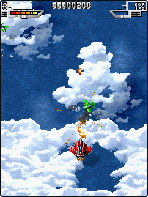
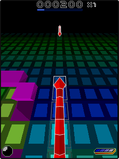

# Sky Force on the WASM launcher

The original Sky Force **1.22, S60 3rd Edition, 240×320** runs on the stock Nokia
5320 firmware already used for Snakes. It reaches Stage 1 combat with keyboard
and touch-button input and non-silent browser audio. No firmware or game patch
was needed. This is a working compatibility result, **not full-speed playback**.

The launcher offers Sky Force, Snakes and manual file loading. Each Play action
reloads into a fresh emulator session. This releases the old workers, audio and
guest memory; game saves are not persisted. The server validates the assets'
SHA-256 hashes, and the browser retains the existing versioned download cache.

## Assets and reproduction

[`games.json`](../wasm/games.json) records the original archive member, source,
UID, digest and IPFS CID. The package is from the
[Sky Force archive](https://www.myabandonware.com/game/sky-force-vxs), specifically
the v1.22 240×320 S60 3rd Edition download. The SISX bytes are unchanged, saved as
`SkyForce.sis`. Its registered caption is `SkyForce`; the launcher uses UID
`0xa020d913` to avoid caption mismatches.

The individual SIS is recursively pinned locally as
`bafybeie2g5e5ev5yaupq7czfeovdcg7oxygpjrxuncy2ypnxsnonliugbe`.
Reading it back through `ipfs cat` reproduces SHA-256
`c3db14b9e3960b8041995a4bb8212bb54f7d18ac94d1c895dc6d9c79d3b25766`
(1,176,624 bytes). This establishes the local pin, not a third-party pinning
service's retention.

See [launcher instructions](../wasm/README.md) for building, serving and running
`game-picker.ts`. Raw logs, intermediate menus and screenshots are retained in
`/home/claude/.scratch/eka-sky-force/`. The tested build snapshot is in
`served-build/` there. Existing N80 download URLs are preserved.

## Local browser measurement

The test enters gameplay through real DOM keyboard input, enables sound by a
button click, exercises left/right keyboard input and a touch control, checks a
390-pixel viewport, then observes about 32 host seconds per game. Measurements
include screenshots. Chromium uses the physical NVIDIA GPU through ANGLE/Vulkan.
Touch input is automated desktop emulation, not a physical-phone test.

| # | Game | Guest seconds | Host seconds | Guest/host ratio | Presentations/s | Audio underruns |
| --- | --- | ---: | ---: | ---: | ---: | ---: |
| 1 | Sky Force | 11.780 | 31.593 | 0.373× | 11.90 | 96 |
| 2 | Snakes | 31.560 | 31.561 | 1.000× | 21.17 | 0 |

Sky Force's slowdown produces frequent audio starvation. It is available to
play and investigate, but smooth full-speed sound is not established. Snakes
retains real-time execution in this route. These short runs do not establish
whole-game compatibility or performance on another host.

Both games run with the existing live compiler policy: IR 7, eager regions 0,
TLB hash 1, exact comparison 2, predicated leaves 1, leaf features 128,
execution limits 512/16/8/512, executable-byte assumption mode 3.

The test verifies fresh audio/input state after switching, correct UIDs, released
installation uploads, nonblank changing frames, input consumption, non-silent
audio, mute, dropdown keyboard focus, no horizontal overflow and manual loading.
The captured frames were also inspected to confirm combat and Snakes gameplay.
Asset-cache, compiler-policy and audio-worklet regression checks pass.

Machine-readable build hashes and measurements are in
[`results.json`](sky-force-evidence/results.json).

## Live HTTPS verification

The same integration check passes at <https://claude-laptop.lan:8188/> in
Chrome 153.0.8010.52 with the existing trusted LAN certificate, without
certificate-bypass flags. Both secure context and cross-origin isolation are
active. No page, HTTP or unexpected request errors occurred. The test switches
from Sky Force combat to Snakes gameplay and then manual loading. The screenshots
above are from this HTTPS run.

| # | Game | Guest seconds | Host seconds | Guest/host ratio | Presentations/s | Audio underruns |
| --- | --- | ---: | ---: | ---: | ---: | ---: |
| 1 | Sky Force | 13.127 | 31.537 | 0.416× | 13.32 | 104 |
| 2 | Snakes | 31.528 | 31.527 | 1.000× | 21.16 | 0 |

The live WASM was downloaded and its SHA-256 matched the tested build:
`91c7d6f6b6df4c335eda2005fd671119a85c1fc57008f8bdf000e49a0825215e`.
The existing N80 ROM/RPKG links return HTTP 200 with the original sizes. This
checks the actual LAN hostname from this host; no separate physical client was
available.
