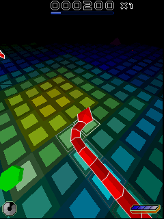
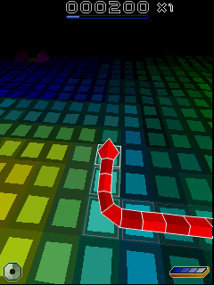

# Snakes stock-resolution survey

Measured 2026-10-01. The highest **verified stock rendering resolution** remains
240×320 on the Nokia 5320. N80's 352×416 screen displays a doubled 176×208 game
image. The optional N80 patch produces more detail, but changes game instructions
and therefore does not qualify as stock behavior.

Three original executable variants contain explicit 320×480 and 480×320 buffer
choices. No released S60 device with those display dimensions was identified.
Those branches are evidence of developer intent in the executable, not proof
of working gameplay on a stock device. No claim is made that every historical
Snakes release or device has been exhausted.

## What the game selects

The [instruction-level audit](audit_snakes_resolution.py) executes the original
ARM rectangle-selection code. Its input is the dimensions returned by the
screen-size helper; the output is the game's chosen rendering rectangle.

| # | Reported screen size | Selected buffer, benchmark SIS and N80 ROM | Archive “Snakes HD” SISX |
|---|---|---|---|
| 1 | 176×208 | 176×208 | 176×208 |
| 2 | 208×176 | 208×176 | 208×176 |
| 3 | 208×208 | 208×208 | 176×208 |
| 4 | 240×320 | 240×320 | 240×320 |
| 5 | 320×240 | 320×240 | 320×240 |
| 6 | 352×416 | 176×208 | 176×208 |
| 7 | 416×352 | 208×176 | 208×176 |
| 8 | 320×480 | 320×480 | 320×480 |
| 9 | 480×320 | 480×320 | 480×320 |
| 10 | 360×640 or 640×360 | 176×208 | 176×208 |
| 11 | 640×480 or 480×640 | 176×208 | 176×208 |
| 12 | 800×352 | 176×208 | 176×208 |
| 13 | 1280×720 | 176×208 | 176×208 |

The game compares exact sizes; this is not a largest-fitting-buffer algorithm.
Unknown dimensions fall back to 176×208. In particular, the
[E6's 640×480 display](https://blogs.windows.com/devices/2011/04/12/launch-nokia-e6/)
and [E90's 800×352 internal display](https://manualzz.com/doc/2635566/nokia-e90-communicator-datasheet)
do not match the higher-resolution branches. An OS compatibility mode might
report a different size or scale the result, but that would not establish more
rendered detail. Neither device's firmware was run in this survey.

## Executables and actual gameplay

| # | Variant | UID | Stock 5320 | Stock N80 |
|---|---|---|---|---|
| 1 | Benchmark SIS, `6r45_1b.exe` | `0x2000730F` | Two 240-frame runs match pixels, guest timing, PCM and audio events | Prior 60-frame runs pass; every image is made of identical 2×2 pixel blocks |
| 2 | N80 ROM-bundled `6r45_1.exe` | `0x10208A45` | Not run | No captured gameplay; reaches the 120-second virtual-time limit |
| 3 | Archive “Snakes HD” SISX, `6r45_1.exe` | `0x10208A45` | 60 gameplay frames and audio pass | No captured gameplay; reaches the virtual-time limit |

The N80 failures repeatedly access `C:\system\data\sts.bin` and `sno.bin`, then
trap a leave with code -1. Their cause is unresolved. They are not successful
stock-game tests, and the selector audit does not replace those tests. The
installed HD run selects its E-drive application resources, so it is distinct
from the separate ROM-only launch.

The successful 5320 captures were inspected visually and pass
`validate_gameplay.py`. The benchmark SIS gives 240 distinct scenes over 11.30
guest seconds, about 21.16 images/s. The HD package gives 60 distinct scenes
over 2.83 seconds, about 20.87 images/s. These are short gameplay tests, not
complete-game compatibility claims.





## Package provenance

The [archive page](https://www.myabandonware.com/game/snakes-msa) supplied three
S60 packages. Its ordinary Snakes SIS is byte-for-byte identical to the existing
benchmark asset. “Snakes HD” is a different executable, but its filename does
not establish additional resolution support. “Snakes Deluxe” is CrazySoft's
different game, UID `0xA00029A2`, and was excluded.

The ordinary SIS and HD SISX each have an RSA/SHA-1 controller signature that
verifies with their embedded `Nokia Content` certificate. Each executable's
SHA-1 matches its file description inside the signed controller region.
The ordinary SIS also contains an additional third-party signature; the Nokia
signature still verifies. This checks the package signatures and executable
hashes, not certificate-chain trust against an independently trusted root.
[Package evidence](stock-resolution-evidence/packages.json) records hashes,
certificate identities and the exact controller byte ranges verified.

## Method and reproduction

All gameplay runs explicitly set `EKA2L1_SNAKES_N80_NATIVE_RESOLUTION=0` and use
fresh installations of the recorded, unchanged ROM/RPKG blobs. No firmware
configuration or game instruction was changed for this survey. The native
replay uses Xvfb, Qt xcb and Mesa software OpenGL. This survey does not add a
browser or hardware-display compatibility claim.

The native binary was preserved from the completed N80 work before its worktree
was removed. Its SHA-256 is
`72d91bc3eaabeb294f150ec717bc4f37cf6691b843b1a5eb4f1a58aa4b3d4fa2`.
The checkout is `4d85089169b8d10490a6ee9829f128d08d4a90ab`; the binary's embedded
revision is older. It was not rebuilt for this harness/documentation change.
[Runtime evidence](stock-resolution-evidence/runtime.json) retains asset hashes,
results, log hashes and failed-run details. Full profiles and logs remain in
`/home/claude/.scratch/snakes-higher-resolution-roms/stock-survey/`, with the
ROM-only run in its sibling `stock-n80-bundled/` directory.

```sh
EKA2L1_SNAKES_N80_NATIVE_RESOLUTION=0 \
python3 src/tests/benchmark/run_native.py \
  --assets /absolute/path/to/5320-assets --binary /absolute/path/to/eka2l1_qt \
  --output /absolute/path/to/new-stock-5320 --frames 240 --repeat 2
```

For a different SIS, supply its hashes through `--asset-manifest` and select
its UID with `--app-uid 0x10208A45`. To test the ROM's bundled game, also pass
`--rom-app`; this skips SIS installation and does not require a SIS file or hash.
It does not promise that the bundled game reaches gameplay.

For the selector audit, obtain decompressed, unrelocated code with a native
debug build. At the `eka2l1::hle::import_e32img` entry breakpoint, conditional on
`img->header.uid3` matching the desired game, use:

```gdb
set $code = &img->data[img->header.code_offset]
dump binary memory /absolute/path/to/code.bin $code $code+img->header.code_size
```

This is before relocation and optional game patching. The exact code hashes
are mandatory inputs to the audit; unknown or modified dumps are rejected.
Install `unicorn==2.1.4` in a separate Python environment, then run:

```sh
python src/tests/benchmark/audit_snakes_resolution.py \
  /absolute/path/to/benchmark-code.bin \
  /absolute/path/to/n80-bundled-code.bin \
  /absolute/path/to/hd-code.bin > selectors.json
```

The audit runs 15 dimensions for each executable. It initializes the registers
and stack at the start of rectangle selection and substitutes only screen-size
retrieval, `TSize` equality and the `TRect` constructor. Code memory is read-only;
a 1,000-instruction cap and the expected exit PC catch incomplete execution.
It stops after the chosen rectangle is copied into the game object, before
bitmap allocation or rendering. [Recorded results](stock-resolution-evidence/selectors.json)
include entry/exit offsets, helper offsets and calls, code hashes and rectangles.

This establishes why changing to a larger stock display alone does not improve
these releases. A higher stock result still needs either another original game
build with different selection logic, or a real stock device that exercises
the existing 320×480/480×320 path, followed by full gameplay validation.
